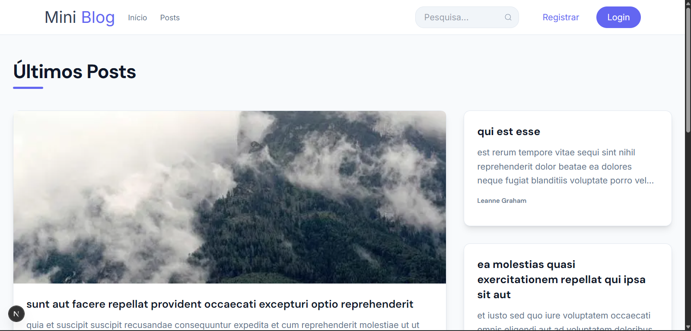

# 📝 Mini Blog

## 📖 Descrição

Mini Blog é um projeto desenvolvido com **Next.js** utilizando a API pública **JSONPlaceholder**.

O objetivo principal do projeto é treinar integração com APIs, organização de código e arquitetura moderna utilizando o App Router do Next.js.

A aplicação simula um mini portal de conteúdo, permitindo:

- Navegação entre posts
- Visualização de detalhes do post
- Exibição de comentários relacionados
- Visualização do perfil do usuário
- Listagem de posts por usuário
- Paginação de posts
- Busca por conteúdo via query string

## 📷 Preview




---

## 🛠 Tecnologias Utilizadas

- Next.js (App Router)
- React
- TypeScript
- TailwindCSS
- JSONPlaceholder API

---

## 🧠 Conceitos Praticados

### 🔹 Arquitetura
- Separação de responsabilidades
- Organização por:
  - `app` (páginas)
  - `components`
  - `services`
  - `types`

### 🔹 Next.js
- Server Components para busca de dados
- Client Components para interatividade
- Navegação dinâmica com `params`
- Uso de `searchParams` para filtros
- Roteamento dinâmico (`/posts/[id]`, `/users/[id]`)

### 🔹 Integração com API
- Consumo de API com `fetch`
- Tratamento de erros
- Filtragem de dados
- Relacionamento entre recursos (posts, users, comments)

### 🔹 TypeScript
- Criação de interfaces e types
- Tipagem de props
- Tipagem de dados vindos da API

---

## ⚙ Funcionalidades

- 📄 Listagem de posts
- 📑 Paginação
- 📌 Página de detalhe do post
- 💬 Comentários relacionados ao post
- 👤 Página de perfil do usuário
- 📝 Listagem de posts por usuário

---

## 🌐 API Utilizada

JSONPlaceholder  
https://jsonplaceholder.typicode.com

### Endpoints consumidos:

- `GET /posts`
- `GET /posts/:id`
- `GET /users`
- `GET /users/:id`
- `GET /comments?postId=:id`

---

## ▶ Como rodar o projeto

```bash
npm install
npm run dev
```

### 🎯 Objetivo do Projeto

- Projeto desenvolvido para estudo com foco em:

- Entender integração com APIs REST

- Aprender a separar Server e Client Components

- Praticar o App Router do Next.js

- Evoluir organização e arquitetura de código

- Melhorar o uso de TypeScript em aplicações reais


## ✅ Melhorias Implementadas 
- Melhorias de UI/UX ✅

## Portfólio

No meu portfólio você encontrará um vídeo demonstrativo desta aplicação, além de outros projetos desenvolvidos por mim.


Portfólio: https://adriano-atbs.vercel.app/